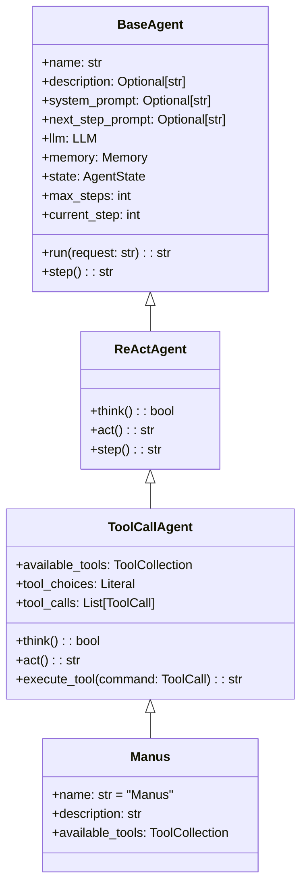
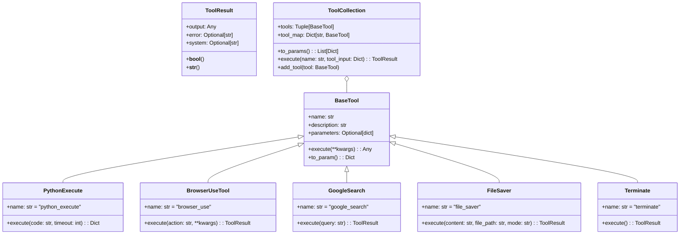
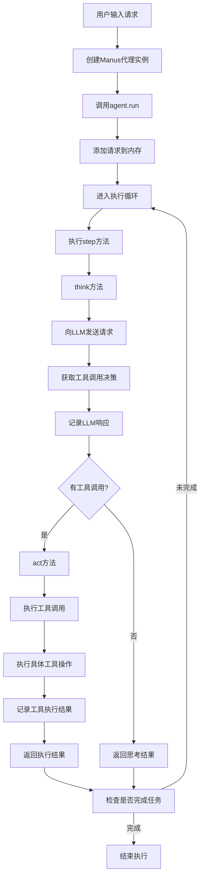
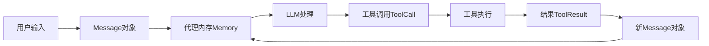

# OpenManus 项目解读文档

## 1. 项目概述

- **项目名称和简介**：OpenManus 是一个开源的智能体项目，旨在提供类似于Manus的功能，但无需邀请码即可使用。它是一个通用型AI助手，能够执行各种任务，包括编程、信息检索、文件处理和网页浏览等。
- **项目目标和功能**：提供一个功能强大的AI助手，能够通过各种工具与计算机和网络交互，解决用户的各种请求。主要功能包括Python代码执行、网页浏览、文件保存、谷歌搜索等。
- **技术栈概述**：
  - 编程语言：Python 3.12
  - 核心依赖：OpenAI API (支持GPT-4o等模型)
  - 关键库：browser_use（浏览器操作）、Pydantic（数据验证）、tenacity（重试机制）
  - 架构模式：代理（Agent）模式、工具（Tool）模式
- **主线说明**：本文档将围绕"从用户输入到智能体完成任务的完整流程"这一主线，详细解析OpenManus的架构设计和关键代码实现。

## 2. 项目结构

- **目录结构解析**：

```
OpenManus/
├── app/                    # 主要应用代码
│   ├── agent/             # 代理类实现
│   ├── prompt/            # 系统提示和指令
│   ├── tool/              # 工具类实现
│   ├── llm.py             # 语言模型交互
│   ├── logger.py          # 日志系统
│   └── schema.py          # 数据结构定义
├── assets/                # 静态资源
├── config/                # 配置文件
├── main.py                # 主入口
├── run_flow.py            # 开发版入口
├── requirements.txt       # 依赖列表
└── setup.py               # 安装脚本
```

- **核心文件说明**：
  - `main.py`：项目的主入口点，实现了命令行交互逻辑
  - `app/agent/manus.py`：Manus代理的实现，定义了代理能力和使用的工具
  - `app/agent/toolcall.py`：工具调用代理的实现，处理工具选择和执行
  - `app/agent/react.py`：ReAct模式代理的基础实现
  - `app/llm.py`：与语言模型交互的封装类
  - `app/tool/*.py`：各种工具的实现（浏览器、执行Python、保存文件等）


## 3. 架构设计

### 3.1 代理层次结构

OpenManus采用了层次化的代理结构，通过继承关系实现功能的逐级扩展：

- `BaseAgent`：所有代理的基类，定义基本状态和执行流程
- `ReActAgent`：实现思考-行动循环的代理基类
- `ToolCallAgent`：能够调用工具的代理实现
- `Manus`：最终的Manus代理，集成所有能力



**代理继承关系核心代码**：

```python
# BaseAgent 基类定义
class BaseAgent(BaseModel, ABC):
    """抽象基类，用于管理代理状态和执行"""
    # 核心属性
    name: str = Field(..., description="代理的唯一名称")
    description: Optional[str] = Field(None, description="可选的代理描述")
    
    # 提示词
    system_prompt: Optional[str] = Field(None, description="系统级指令提示")
    next_step_prompt: Optional[str] = Field(None, description="确定下一步操作的提示")
    
    # 依赖项
    llm: LLM = Field(default_factory=LLM, description="语言模型实例")
    memory: Memory = Field(default_factory=Memory, description="代理的内存存储")
    state: AgentState = Field(default=AgentState.IDLE, description="当前代理状态")
    
    # 执行控制
    max_steps: int = Field(default=10, description="终止前的最大步骤数")
    current_step: int = Field(default=0, description="执行中的当前步骤")
    
    async def run(self, request: Optional[str] = None) -> str:
        """执行代理的主循环"""
        if self.state != AgentState.IDLE:
            raise RuntimeError(f"Cannot run agent from state: {self.state}")

        if request:
            self.update_memory("user", request)

        results: List[str] = []
        async with self.state_context(AgentState.RUNNING):
            while (
                self.current_step < self.max_steps and self.state != AgentState.FINISHED
            ):
                self.current_step += 1
                logger.info(f"Executing step {self.current_step}/{self.max_steps}")
                step_result = await self.step()  # 执行单个步骤

                # 检查循环状态
                if self.is_stuck():
                    self.handle_stuck_state()

                results.append(f"Step {self.current_step}: {step_result}")

            if self.current_step >= self.max_steps:
                results.append(f"Terminated: Reached max steps ({self.max_steps})")

        return "\n".join(results) if results else "No steps executed"
```

```python
# ReActAgent 实现思考-行动循环
class ReActAgent(BaseAgent, ABC):
    """实现思考-行动循环的代理"""
    @abstractmethod
    async def think(self) -> bool:
        """处理当前状态并决定下一步操作"""
        pass
    
    @abstractmethod
    async def act(self) -> str:
        """执行决定的操作"""
        pass
    
    async def step(self) -> str:
        """执行单个步骤：思考和行动"""
        should_act = await self.think()
        if not should_act:
            return "Thinking complete - no action needed"
        return await self.act()
```

```python
# ToolCallAgent 实现工具调用功能
class ToolCallAgent(ReActAgent):
    """处理工具/函数调用的基础代理类"""
    name: str = "toolcall"
    description: str = "an agent that can execute tool calls."

    system_prompt: str = SYSTEM_PROMPT
    next_step_prompt: str = NEXT_STEP_PROMPT

    available_tools: ToolCollection = ToolCollection(
        CreateChatCompletion(), Terminate()
    )
    tool_choices: Literal["none", "auto", "required"] = "auto"
    special_tool_names: List[str] = Field(default_factory=lambda: [Terminate().name])

    tool_calls: List[ToolCall] = Field(default_factory=list)

    max_steps: int = 30
    
    async def think(self) -> bool:
        """处理当前状态并使用工具决定下一步操作"""
        if self.next_step_prompt:
            user_msg = Message.user_message(self.next_step_prompt)
            self.messages += [user_msg]

        # 获取带工具选项的响应
        response = await self.llm.ask_tool(
            messages=self.messages,
            system_msgs=[Message.system_message(self.system_prompt)]
            if self.system_prompt
            else None,
            tools=self.available_tools.to_params(),
            tool_choice=self.tool_choices,
        )
        self.tool_calls = response.tool_calls
        
        # 记录响应并处理工具调用
        # ...省略部分代码...
        
        return bool(self.tool_calls)  # 如果有工具调用则返回True
```

```python
# Manus 最终代理实现
class Manus(ToolCallAgent):
    """
    一个通用的智能体，使用规划能力解决各种任务。
    
    这个智能体通过整合多种工具和能力，包括Python执行、网页浏览、
    文件操作和信息检索，处理各种用户请求。
    """
    name: str = "Manus"
    description: str = "一个能够使用多种工具解决各种任务的多功能智能体"

    system_prompt: str = SYSTEM_PROMPT
    next_step_prompt: str = NEXT_STEP_PROMPT

    # 添加通用工具到工具集合
    available_tools: ToolCollection = Field(
        default_factory=lambda: ToolCollection(
            PythonExecute(), GoogleSearch(), BrowserUseTool(), FileSaver(), Terminate()
        )
    )
```

### 3.2 工具系统设计

工具系统是OpenManus的核心功能组件，提供了与外部世界交互的能力：

- `BaseTool`：所有工具的基类，定义执行接口
- `ToolCollection`：工具管理类，负责工具注册和调用
- 具体工具实现：
  - `BrowserUseTool`：浏览器交互工具
  - `PythonExecute`：Python代码执行工具
  - `GoogleSearch`：谷歌搜索工具
  - `FileSaver`：文件保存工具
  - `Terminate`：终止执行的工具



**工具系统核心代码**：

```python
# 基础工具类
class BaseTool(ABC, BaseModel):
    """所有工具的抽象基类"""
    name: str
    description: str
    parameters: Optional[dict] = None
    
    class Config:
        arbitrary_types_allowed = True
    
    async def __call__(self, **kwargs) -> Any:
        """使用给定参数执行工具"""
        return await self.execute(**kwargs)
    
    @abstractmethod
    async def execute(self, **kwargs) -> Any:
        """使用给定参数执行工具的核心方法"""
    
    def to_param(self) -> Dict:
        """将工具转换为函数调用格式"""
        return {
            "type": "function",
            "function": {
                "name": self.name,
                "description": self.description,
                "parameters": self.parameters,
            },
        }
```

```python
# 工具结果类
class ToolResult(BaseModel):
    """表示工具执行的结果"""
    output: Any = Field(default=None)
    error: Optional[str] = Field(default=None)
    system: Optional[str] = Field(default=None)
    
    class Config:
        arbitrary_types_allowed = True
    
    def __bool__(self):
        return any(getattr(self, field) for field in self.__fields__)
    
    # ...其他方法...
```

```python
# 工具集合类
class ToolCollection:
    """定义工具的集合"""
    def __init__(self, *tools: BaseTool):
        self.tools = tools
        self.tool_map = {tool.name: tool for tool in tools}
    
    def __iter__(self):
        return iter(self.tools)
    
    def to_params(self) -> List[Dict[str, Any]]:
        return [tool.to_param() for tool in self.tools]
    
    async def execute(self, *, name: str, tool_input: Dict[str, Any] = None) -> ToolResult:
        """执行指定的工具"""
        tool = self.tool_map.get(name)
        if not tool:
            return ToolFailure(error=f"Tool {name} is invalid")
        try:
            result = await tool(**tool_input)
            return result
        except ToolError as e:
            return ToolFailure(error=e.message)
    
    # ...其他方法...
```

### 3.3 语言模型接口

LLM类是系统与OpenAI API交互的核心组件，实现为单例模式：

```python
class LLM:
    """LLM类 - 用于处理与OpenAI LLM模型的交互"""
    _instances: Dict[str, "LLM"] = {}  # 存储LLM实例的字典，用于实现单例模式

    def __new__(cls, config_name: str = "default", llm_config: Optional[LLMSettings] = None):
        """实现单例模式的工厂方法"""
        if config_name not in cls._instances:
            instance = super().__new__(cls)
            instance.__init__(config_name, llm_config)
            cls._instances[config_name] = instance
        return cls._instances[config_name]
    
    # ...初始化和配置方法...
    
    @retry(wait=wait_random_exponential(min=1, max=60), stop=stop_after_attempt(6))
    async def ask_tool(
        self,
        messages: List[Union[dict, Message]],
        system_msgs: Optional[List[Union[dict, Message]]] = None,
        timeout: int = 60,
        tools: Optional[List[dict]] = None,
        tool_choice: Literal["none", "auto", "required"] = "auto",
        temperature: Optional[float] = None,
        **kwargs,
    ):
        """使用函数/工具向LLM发送请求并获取响应"""
        try:
            # 格式化消息和系统消息
            formatted_messages = self.format_messages(messages)
            if system_msgs:
                formatted_messages = self.format_messages(system_msgs) + formatted_messages
            
            # 设置请求参数并调用API
            response = await self.client.chat.completions.create(
                model=self.model,
                messages=formatted_messages,
                temperature=temperature or self.temperature,
                max_tokens=self.max_tokens,
                tools=tools,
                tool_choice=tool_choice,
                timeout=timeout,
                **kwargs,
            )
            
            # 返回模型响应
            return response.choices[0].message
            
        except Exception as e:
            # 处理各种异常
            # ...省略异常处理代码...
```

## 4. 核心组件详解

### 4.1 执行入口与主流程



项目的主入口点是`main.py`，它实现了简单的命令行交互逻辑：

```python
async def main():
    agent = Manus()
    while True:
        try:
            prompt = input("Enter your prompt (or 'exit' to quit): ")
            if prompt.lower() == "exit":
                logger.info("Goodbye!")
                break
            logger.warning("Processing your request...")
            await agent.run(prompt)
        except KeyboardInterrupt:
            logger.warning("Goodbye!")
            break

if __name__ == "__main__":
    asyncio.run(main())
```

当用户输入请求后，主要的执行流程为：
1. 创建Manus代理实例
2. 调用`agent.run(prompt)`开始处理用户请求
3. 在`BaseAgent.run()`方法中进入主执行循环
4. 循环执行`step()`方法，包含思考和行动两个阶段
5. 直到达到最大步骤数或任务完成

### 4.2 思考-行动循环详解

思考-行动循环是ReAct代理的核心机制，通过`think()`和`act()`方法实现：

```python
# 在ToolCallAgent中实现的think方法
async def think(self) -> bool:
    """处理当前状态并使用工具决定下一步操作"""
    if self.next_step_prompt:
        user_msg = Message.user_message(self.next_step_prompt)
        self.messages += [user_msg]

    # 获取带工具选项的响应
    response = await self.llm.ask_tool(
        messages=self.messages,
        system_msgs=[Message.system_message(self.system_prompt)]
        if self.system_prompt
        else None,
        tools=self.available_tools.to_params(),
        tool_choice=self.tool_choices,
    )
    self.tool_calls = response.tool_calls
    
    # 如果有内容，添加到内存
    if response.content:
        assistant_msg = Message.assistant_message(
            content=response.content, tool_calls=self.tool_calls
        )
        self.memory.add_message(assistant_msg)
    
    return bool(self.tool_calls)  # 如果有工具调用则返回True
```

```python
# 在ToolCallAgent中实现的act方法
async def act(self) -> str:
    """执行工具调用并处理结果"""
    if not self.tool_calls:
        # 处理无工具调用的情况
        return self.messages[-1].content or "No content or commands to execute"

    results = []
    for command in self.tool_calls:
        result = await self.execute_tool(command)
        logger.info(
            f"🎯 Tool '{command.function.name}' completed its mission! Result: {result}"
        )

        # 将工具响应添加到内存
        tool_msg = Message.tool_message(
            content=result, tool_call_id=command.id, name=command.function.name
        )
        self.memory.add_message(tool_msg)
        results.append(result)

    return "\n\n".join(results)
```

### 4.3 工具执行机制

工具执行是系统的核心功能之一，通过`ToolCallAgent.execute_tool`方法实现：

```python
async def execute_tool(self, command: ToolCall) -> str:
    """执行单个工具调用并进行错误处理"""
    if not command or not command.function or not command.function.name:
        return "Error: Invalid command format"

    name = command.function.name
    if name not in self.available_tools.tool_map:
        return f"Error: Unknown tool '{name}'"

    try:
        # 解析参数
        args = json.loads(command.function.arguments or "{}")

        # 执行工具
        logger.info(f"🔧 Activating tool: '{name}'...")
        result = await self.available_tools.execute(name=name, tool_input=args)

        # 格式化结果
        observation = (
            f"Observed output of cmd `{name}` executed:\n{str(result)}"
            if result
            else f"Cmd `{name}` completed with no output"
        )

        # 处理特殊工具
        await self._handle_special_tool(name=name, result=result)

        return observation
    except json.JSONDecodeError:
        return f"Error: Invalid JSON in arguments: {command.function.arguments}"
    except Exception as e:
        return f"Error executing tool '{name}': {str(e)}"
```

### 4.4 浏览器工具详解

`BrowserUseTool`是系统中最复杂的工具之一，提供了丰富的浏览器交互功能：

```python
class BrowserUseTool(BaseTool):
    """浏览器操作工具类，提供各种浏览器交互功能"""
    
    # 工具基本属性
    name: str = "browser_use"
    description: str = _BROWSER_DESCRIPTION
    
    # 定义工具参数schema
    parameters: dict = {
        "type": "object",
        "properties": {
            "action": {
                "type": "string",
                "enum": [
                    "navigate",    # 导航到指定URL
                    "click",       # 点击元素
                    "input_text",  # 输入文本
                    "screenshot",  # 截图
                    "get_html",    # 获取页面HTML
                    "execute_js",  # 执行JavaScript代码
                    "scroll",      # 滚动页面
                    "switch_tab",  # 切换标签页
                    "new_tab",     # 新建标签页
                    "close_tab",   # 关闭当前标签页
                    "refresh",     # 刷新页面
                ],
                "description": "要执行的浏览器操作",
            },
            # ...其他参数定义...
        },
        "required": ["action"],
    }
    
    # 类属性定义
    lock: asyncio.Lock = Field(default_factory=asyncio.Lock)  # 用于线程同步的锁
    browser: Optional[BrowserUseBrowser] = Field(default=None, exclude=True)  # 浏览器实例
    context: Optional[BrowserContext] = Field(default=None, exclude=True)     # 浏览器上下文
    dom_service: Optional[DomService] = Field(default=None, exclude=True)     # DOM服务实例
    
    async def _ensure_browser_initialized(self) -> BrowserContext:
        """确保浏览器已初始化"""
        if not self.browser:
            config = BrowserConfig(headless=False)
            self.browser = BrowserUseBrowser(config)
            self.context = await self.browser.new_context()
            self.dom_service = DomService(self.context)
        return self.context
    
    async def execute(
        self,
        action: str,
        url: Optional[str] = None,
        index: Optional[int] = None,
        text: Optional[str] = None,
        script: Optional[str] = None,
        scroll_amount: Optional[int] = None,
        tab_id: Optional[int] = None,
        **kwargs,
    ) -> ToolResult:
        """执行指定的浏览器操作"""
        async with self.lock:  # 使用锁确保操作的线程安全
            try:
                context = await self._ensure_browser_initialized()

                if action == "navigate":
                    if not url:
                        return ToolResult(error="URL is required for 'navigate' action")
                    await context.navigate_to(url)
                    return ToolResult(output=f"Navigated to {url}")
                
                elif action == "click":
                    if index is None:
                        return ToolResult(error="Element index is required for 'click' action")
                    await self.dom_service.click_element(index)
                    return ToolResult(output=f"Clicked element at index {index}")
                
                # ...其他操作的实现...
                
            except Exception as e:
                return ToolResult(error=f"Browser action '{action}' failed: {str(e)}")
```

### 4.5 Python执行工具

`PythonExecute`工具展示了OpenManus如何实现代码执行功能：

```python
class PythonExecute(BaseTool):
    """执行Python代码的工具，带有超时和安全限制"""

    name: str = "python_execute"
    description: str = "执行Python代码字符串。注意：只有打印输出是可见的，函数返回值不会被捕获。使用print语句查看结果。"
    parameters: dict = {
        "type": "object",
        "properties": {
            "code": {
                "type": "string",
                "description": "要执行的Python代码",
            },
        },
        "required": ["code"],
    }

    async def execute(
        self,
        code: str,
        timeout: int = 5,
    ) -> Dict:
        """
        执行提供的Python代码，带有超时限制
        
        Args:
            code (str): 要执行的Python代码
            timeout (int): 执行超时时间（秒）
            
        Returns:
            Dict: 包含执行输出或错误消息的字典
        """
        result = {"observation": ""}

        def run_code():
            try:
                safe_globals = {"__builtins__": dict(__builtins__)}

                import sys
                from io import StringIO

                output_buffer = StringIO()
                sys.stdout = output_buffer

                exec(code, safe_globals, {})

                sys.stdout = sys.__stdout__

                result["observation"] = output_buffer.getvalue()

            except Exception as e:
                result["observation"] = str(e)
                result["success"] = False

        thread = threading.Thread(target=run_code)
        thread.start()
        thread.join(timeout)

        if thread.is_alive():
            return {
                "observation": f"执行超时，超过{timeout}秒",
                "success": False,
            }

        return result
```
### 4.6 文件保存工具实现

文件保存工具允许代理将内容保存到文件系统，实现数据持久化：

```python
class FileSaver(BaseTool):
    """保存内容到文件的工具"""
    
    name: str = "file_saver"
    description: str = "将内容保存到指定路径的文件中"
    parameters: dict = {
        "type": "object",
        "properties": {
            "content": {
                "type": "string",
                "description": "要保存的内容",
            },
            "file_path": {
                "type": "string",
                "description": "保存文件的路径",
            },
            "mode": {
                "type": "string",
                "enum": ["w", "a"],
                "description": "文件打开模式：'w'表示覆盖写入，'a'表示追加",
                "default": "w",
            },
        },
        "required": ["content", "file_path"],
    }
    
    async def execute(
        self, content: str, file_path: str, mode: str = "w"
    ) -> ToolResult:
        """
        将内容保存到文件
        
        Args:
            content (str): 要保存的内容
            file_path (str): 文件路径
            mode (str): 文件打开模式，'w'覆盖或'a'追加
            
        Returns:
            ToolResult: 包含操作结果的对象
        """
        try:
            # 确保目录存在
            os.makedirs(os.path.dirname(os.path.abspath(file_path)), exist_ok=True)
            
            # 写入文件
            with open(file_path, mode, encoding="utf-8") as f:
                f.write(content)
            
            return ToolResult(
                output=f"Content successfully saved to {file_path} in {mode} mode"
            )
        except Exception as e:
            return ToolResult(error=f"Failed to save file: {str(e)}")
```

## 5. 关键功能实现分析

从用户输入到任务完成的完整流程包括以下关键步骤和相应的代码实现：

### 5.1 用户输入处理

```python
# main.py中获取用户输入
prompt = input("Enter your prompt (or 'exit' to quit): ")
# 处理请求
await agent.run(prompt)

# BaseAgent.run方法中处理用户输入
if request:
    self.update_memory("user", request)
```

### 5.2 代理执行循环

```python
# BaseAgent.run方法中的主执行循环
async with self.state_context(AgentState.RUNNING):
    while (
        self.current_step < self.max_steps and self.state != AgentState.FINISHED
    ):
        self.current_step += 1
        logger.info(f"Executing step {self.current_step}/{self.max_steps}")
        step_result = await self.step()  # 执行单个步骤

        # 检查循环状态
        if self.is_stuck():
            self.handle_stuck_state()

        results.append(f"Step {self.current_step}: {step_result}")
```

### 5.3 LLM工具选择

```python
# ToolCallAgent.think方法中的LLM工具选择
response = await self.llm.ask_tool(
    messages=self.messages,
    system_msgs=[Message.system_message(self.system_prompt)]
    if self.system_prompt
    else None,
    tools=self.available_tools.to_params(),
    tool_choice=self.tool_choices,
)
self.tool_calls = response.tool_calls

# 如果有内容，添加到内存
if response.content:
    assistant_msg = Message.assistant_message(
        content=response.content, tool_calls=self.tool_calls
    )
    self.memory.add_message(assistant_msg)
```

### 5.4 工具执行和结果处理

```python
# ToolCallAgent.act方法中的工具执行和结果处理
results = []
for command in self.tool_calls:
    result = await self.execute_tool(command)
    logger.info(
        f"🎯 Tool '{command.function.name}' completed its mission! Result: {result}"
    )

    # 将工具响应添加到内存
    tool_msg = Message.tool_message(
        content=result, tool_call_id=command.id, name=command.function.name
    )
    self.memory.add_message(tool_msg)
    results.append(result)
```

## 6. 数据流分析

OpenManus的数据流以消息（Message）为核心，从用户输入到工具执行结果，形成完整的循环：

```
用户输入 → Message对象 → 代理内存(Memory) → LLM处理(ask_tool) → 
工具调用(ToolCall) → 工具执行(execute_tool) → 结果(ToolResult) → 
新Message对象 → 代理内存 → 循环继续...
```



这一数据流通过以下关键数据结构实现：

```python
# 消息类，表示对话中的各类消息
class Message(BaseModel):
    role: str  # "user", "assistant", "system", "tool"
    content: Optional[str] = None
    tool_calls: Optional[List[ToolCall]] = None
    tool_call_id: Optional[str] = None
    name: Optional[str] = None
    
    @classmethod
    def user_message(cls, content: str) -> "Message":
        """创建用户消息"""
        return cls(role="user", content=content)
    
    @classmethod
    def assistant_message(cls, content: Optional[str] = None, tool_calls: Optional[List[ToolCall]] = None) -> "Message":
        """创建助手消息"""
        return cls(role="assistant", content=content, tool_calls=tool_calls)
    
    @classmethod
    def system_message(cls, content: str) -> "Message":
        """创建系统消息"""
        return cls(role="system", content=content)
    
    @classmethod
    def tool_message(cls, content: str, tool_call_id: str, name: str) -> "Message":
        """创建工具消息"""
        return cls(role="tool", content=content, tool_call_id=tool_call_id, name=name)

# 代理内存，存储对话历史
class Memory(BaseModel):
    messages: List[Message] = Field(default_factory=list)
    
    def add_message(self, message: Message) -> None:
        """添加消息到内存"""
        self.messages.append(message)
    
    def get_messages(self) -> List[Message]:
        """获取所有消息"""
        return self.messages
    
    def clear(self) -> None:
        """清空内存"""
        self.messages = []
```

数据流的关键环节在于`ToolCallAgent`的`think()`和`act()`方法，它们分别负责从LLM获取工具调用决策和执行这些工具调用：

```python
# 思考阶段：获取LLM决策
async def think(self) -> bool:
    # 向LLM发送请求，获取工具调用决策
    response = await self.llm.ask_tool(
        messages=self.messages,
        system_msgs=[Message.system_message(self.system_prompt)],
        tools=self.available_tools.to_params(),
        tool_choice=self.tool_choices,
    )
    self.tool_calls = response.tool_calls
    
    # 记录LLM响应到内存
    if response.content:
        assistant_msg = Message.assistant_message(
            content=response.content, tool_calls=self.tool_calls
        )
        self.memory.add_message(assistant_msg)
    
    return bool(self.tool_calls)

# 行动阶段：执行工具调用
async def act(self) -> str:
    # 执行每个工具调用
    for command in self.tool_calls:
        result = await self.execute_tool(command)
        
        # 记录工具执行结果到内存
        tool_msg = Message.tool_message(
            content=result, tool_call_id=command.id, name=command.function.name
        )
        self.memory.add_message(tool_msg)
```

## 7. 完整流程示例

下面通过一个完整的示例，展示从用户输入到任务完成的整个流程：

### 示例：用户请求"查找关于人工智能的最新新闻并保存到文件"

1. **用户输入处理**：

```python
# 用户输入
prompt = "查找关于人工智能的最新新闻并保存到文件"

# 在main.py中处理
await agent.run(prompt)

# 在BaseAgent.run中添加到内存
self.update_memory("user", request)
```

2. **思考阶段**：

```python
# ToolCallAgent.think方法向LLM发送请求
response = await self.llm.ask_tool(
    messages=self.messages,  # 包含用户请求
    system_msgs=[Message.system_message(self.system_prompt)],
    tools=self.available_tools.to_params(),  # 提供可用工具列表
    tool_choice="auto",
)

# LLM决定使用GoogleSearch工具
self.tool_calls = [
    ToolCall(
        id="call_123",
        function=Function(
            name="google_search",
            arguments='{"query": "latest artificial intelligence news"}'
        )
    )
]
```

3. **行动阶段 - 搜索**：

```python
# ToolCallAgent.act方法执行工具调用
result = await self.execute_tool(command)  # 执行GoogleSearch

# GoogleSearch.execute方法
async def execute(self, query: str) -> ToolResult:
    search_results = await self._perform_search(query)
    return ToolResult(output=f"Search results for '{query}':\n{search_results}")

# 将结果添加到内存
tool_msg = Message.tool_message(
    content="Search results for 'latest artificial intelligence news':\n...",
    tool_call_id="call_123",
    name="google_search"
)
self.memory.add_message(tool_msg)
```

4. **思考阶段（第二轮）**：

```python
# 再次向LLM发送请求，包含搜索结果
response = await self.llm.ask_tool(
    messages=self.messages,  # 现在包含搜索结果
    system_msgs=[Message.system_message(self.system_prompt)],
    tools=self.available_tools.to_params(),
    tool_choice="auto",
)

# LLM决定使用FileSaver工具
self.tool_calls = [
    ToolCall(
        id="call_456",
        function=Function(
            name="file_saver",
            arguments='{"content": "最新人工智能新闻摘要：\\n1. OpenAI发布GPT-5...\\n2. Google推出新的AI研究项目...\\n...", "file_path": "ai_news.txt"}'
        )
    )
]
```

5. **行动阶段 - 保存文件**：

```python
# 执行FileSaver工具
result = await self.execute_tool(command)

# FileSaver.execute方法
async def execute(self, content: str, file_path: str, mode: str = "w") -> ToolResult:
    with open(file_path, mode, encoding="utf-8") as f:
        f.write(content)
    return ToolResult(output=f"Content successfully saved to {file_path}")

# 将结果添加到内存
tool_msg = Message.tool_message(
    content="Content successfully saved to ai_news.txt",
    tool_call_id="call_456",
    name="file_saver"
)
self.memory.add_message(tool_msg)
```

6. **思考阶段（第三轮）**：

```python
# 再次向LLM发送请求，包含文件保存结果
response = await self.llm.ask_tool(
    messages=self.messages,
    system_msgs=[Message.system_message(self.system_prompt)],
    tools=self.available_tools.to_params(),
    tool_choice="auto",
)

# LLM决定任务已完成，不需要更多工具调用
self.tool_calls = []  # 空列表表示不需要更多工具调用
```

7. **完成任务**：

```python
# 由于没有工具调用，ToolCallAgent.think返回False
should_act = await self.think()  # 返回False

# 在ReActAgent.step中处理
if not should_act:
    return "Thinking complete - no action needed"

# 在BaseAgent.run中检查状态
if self.state == AgentState.FINISHED:
    break  # 退出主循环
```
